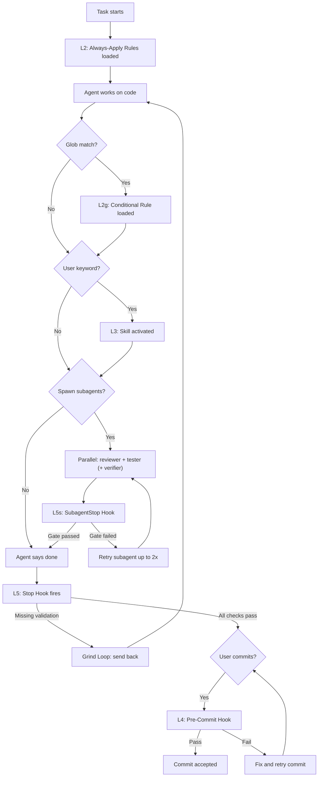

# Agent System Overview

Central map of all enforcement mechanisms grouped by reliability level.

## Layer Overview

| Level | Type | Reliability | Trigger |
|---|---|---|---|
| L1 | Conversation | ~50% | User mentions it in chat |
| L2 | Always-Apply Rules | ~80% | Loaded into every chat automatically |
| L2g | Glob-Triggered Rules | ~80% | Loaded when matching files are edited |
| L3 | Skills | ~85-90% | Keyword match from user prompt |
| L3 | Commands | ~95% | Explicit user-triggered `/command` |
| L4 | Pre-Commit Hook | 100% | Deterministic, blocks bad commits |
| L5 | Stop Hook / Grind Loop | 100% | Deterministic, fires when agent says "done" |
| L5s | SubagentStop Hook | 100% | Deterministic, fires when a subagent completes |

## Execution Order

When the agent works on a task, enforcement fires in this order:



## L2 — Always-Apply Rules

| File | What it does | Triggers/References |
|---|---|---|
| `code-changes-enforcement.mdc` | Enforces post-change validation for 1+ Swift files. Three layers: advisory rule, stop hook, pre-commit. | `post-task-check.sh`, `code-changes.stamp.md`, `reviewing-code-changes/SKILL.md` |
| `build-and-test.mdc` | All xcodebuild commands (build, unit/UI/package tests). DEVELOPER_DIR setup. Forbids swift test/swift build. | Referenced by hook, command, 2 skills |
| `architecture-documentation-sync.mdc` | Enforces architecture-documentation.md sync when structural Swift changes occur. Stop hook Check 2 verifies at task end. | `architecture-documentation.md`, `reviewing-code-changes/SKILL.md` |
| `ui-state-sync-enforcement.mdc` | Forbids monotonic Int-counter (`changeVersion`, `mutationVersion`, `dataGeneration`, `revision`) + `while !Task.isCancelled` polling-loop pattern as primary UI sync. Two layers: rule (advisory) + pre-commit Check 4 (blocking) + stop hook Check 7 (hint). Override via `.claude/hooks/state/ui-state-sync-exception.stamp.md` (24h, ADR required). | `ui-state-sync.sh`, `ui-state-sync-exception.stamp.md`, ADR-0001 |

## L2g — Glob-Triggered Rules

| File | Glob Pattern | What it does |
|---|---|---|
| `agent-infrastructure-enforcement.mdc` | `.claude/rules/**/*.mdc`, `.claude/skills/**/*.md`, `.claude/hooks/**/*.sh`, `.claude/agents/**/*.md`, `.claude/references/**/*.md`, `.claude/commands/**/*.md`, `AGENTS.md` | Enforces agent-infrastructure validation when infrastructure files under `.claude/` change. Excludes `.claude/plans/` (descriptive only) and `.claude/hooks/state/` (runtime artifacts). Two layers: this rule (advisory) + stop hook Check 6. |

## L3 — Skills

| File | What it does | Triggers/References |
|---|---|---|
| `create-feature/SKILL.md` | Scaffold new SwiftUI features with MVVM, AppStyle, navigation, tests. | `architecture-documentation.md`, `ui-test-conventions.md` |
| `reviewing-code-changes/SKILL.md` | Orchestrator: spawns reviewer + tester subagents in parallel. Review checklist: dead code, reuse, AppStyle, layout, MVVM, navigation, architecture principles, anti-patterns, referential integrity, architecture sync. | `architecture-documentation.md`, `code-changes.stamp.md`, `agents/reviewer.md`, `agents/tester.md` |
| `reviewing-test-quality/SKILL.md` | Unit/integration test quality review. | `architecture-documentation.md`, `test-execution.stamp.md` |
| `reviewing-agent-effectiveness/SKILL.md` | Diagnose which enforcement mechanisms fired (FIRED/NOT FIRED/N/A report). Hands off gaps to `reviewing-agent-infrastructure` skill. | All rules, skills, hooks |
| `writing-ui-tests/SKILL.md` | Create new XCUITests. | `ui-test-conventions.md` |
| `updating-ui-tests/SKILL.md` | Refactor/modernize existing XCUITests (passing tests with outdated patterns). | `ui-test-conventions.md`, `debugging-ui-tests/SKILL.md` |
| `debugging-ui-tests/SKILL.md` | Diagnose failing XCUITests: selector-not-found, scheme/build-config, fixture seeding, timing. 5-step decision tree. | `ui-test-conventions.md § Diagnosing a Failing Selector`, `build-and-test.mdc`, `reviewing-agent-effectiveness/SKILL.md`, `reviewing-agent-infrastructure/SKILL.md` |
| `reviewing-agent-infrastructure/SKILL.md` | Validate and fix agent infrastructure after .claude/ changes. Reference integrity, agent-system-overview sync, learning persistence. Spawns verifier subagent. | `reviewing-agent-effectiveness/SKILL.md`, `reviewing-code-changes/SKILL.md`, `agents/verifier.md` |
| `deep-research/SKILL.md` | Citation-backed deep research workflow. | None |

## L3 — Commands

| File | What it does |
|---|---|
| `validate.md` | `/validate` — run post-change validation, tests, write stamps. |

## L4 — Pre-Commit Hook

| File | What it checks |
|---|---|
| `.git/hooks/pre-commit` | Five blocking checks (in execution order): (1) 1+ staged Swift files without fresh `code-changes.stamp.md`; (2) `print()` in production Swift; (3) `adr-required` triggers (see L5 hooks) without ADR or exception stamp; (4) `ui-state-sync-enforcement.mdc` anti-pattern (Int-counter + polling loop) without exception stamp; (5) structural changes without `architecture-documentation.md` update. All blocks use RULE/VIOLATION/FIX format. |

## L5 — Stop Hook

Three enforcement patterns: **Grind Loop** (agent is sent back up to 3 times), **Grind Loop + Verifier** (stamp content validated, Verifier subagent writes stamp), and **Hint** (one-time suggestion).

| File | Pattern | What it checks |
|---|---|---|
| `post-task-check.sh` | Orchestrator | Runs all 10 checks below, collects followup messages. |
| `settings.json` | — | Registers `post-task-check.sh` as `Stop` hook. Claude Code's `stop_hook_active` flag prevents infinite re-firing. |
| `checks/code-validation.sh` | Grind Loop | Swift files changed — validation stamp fresh? |
| `checks/architecture-sync.sh` | Stateless | Structural changes — architecture-documentation.md updated? |
| `checks/test-execution.sh` | Grind Loop | Test files changed — tests actually run? |
| `checks/test-coverage.sh` | Hint | New ViewModel/Service — corresponding test file exists? |
| `checks/enforcement-audit.sh` | Hint | 5+ Swift files — suggest enforcement audit? |
| `checks/agent-infrastructure.sh` | Grind Loop + Verifier | .claude/ files changed — stamp fresh + content-validated (8 required fields)? |
| `checks/ui-state-sync.sh` | Hint | Diff combines `changeVersion`-style Int counter + `while !Task.isCancelled` polling loop (ui-state-sync-enforcement.mdc anti-pattern)? |
| `checks/duplicate-state.sh` | Hint | Diff introduces a new `@State private var XViewModel` while a UUID-keyed VM cache for the same entity already exists (reviewing-code-changes §13h)? |
| `checks/predicate-smell.sh` | Hint | Diff introduces `#Predicate` with optional/force chain, `persistentModelID` comparison, or `@ModelActor` (reviewing-code-changes §14)? |
| `checks/adr-required.sh` | Hint | Structural change detected (new @Observable in service, observation outside view, polling loop in service/VM, schema change, new package, Container.swift change) without an ADR present in working tree? |
| `lib/grind-loop.sh` | Library | Shared grind-loop logic (stamp check, scratchpad, iteration, optional stamp content validation). |
| `lib/adr-triggers.sh` | Library | Shared ADR trigger detection (used by both stop-hook check and `.git/hooks/pre-commit`). |

## L5s — SubagentStop Hook

The `SubagentStop` hook fires when a subagent (Task tool) completes. It reads the parent transcript (`transcript_path`), finds the most recent `Task` tool call, extracts the `subagent_type` plus the tool result, and applies role-specific quality gates. Failures are returned via exit code 2 + stderr (Claude Code's blocker mechanism, similar to a follow-up message). Claude Code's own `stop_hook_active` flag prevents infinite loops.

| File | Role | What it checks |
|---|---|---|
| `subagent-gate.sh` | `verifier` | `agent-infrastructure.stamp.md` exists + has 8 required fields (result, verified_by, 6 checklist items) |
| `subagent-gate.sh` | `reviewer` | Output contains severity tags (Bug/Nit/Pre-existing) or "No issues found" + Summary section + `code-changes.stamp.md` with `verified_by` |
| `subagent-gate.sh` | `tester` | `test-execution.stamp.md` exists + contains success marker (all passed / TEST SUCCEEDED) |
| `settings.json` | — | Registers `subagent-gate.sh` as `SubagentStop` hook |

## Agent Roles

Reusable prompt templates for specialized subagents. Each role file lives in `.claude/agents/` and defines purpose, checklist, output format, and stamp-writing instructions.

| Role | File | Spawned by | Gate | Stamp |
|---|---|---|---|---|
| Verifier | `agents/verifier.md` | `reviewing-agent-infrastructure/SKILL.md` | 8 required stamp fields | `agent-infrastructure.stamp.md` |
| Reviewer | `agents/reviewer.md` | `reviewing-code-changes/SKILL.md` | Severity tags + summary | `code-changes.stamp.md` |
| Tester | `agents/tester.md` | `reviewing-code-changes/SKILL.md` | xcodebuild success | `test-execution.stamp.md` |

### Parallel Execution Pattern

After the main agent completes work, the orchestrating skill spawns applicable subagents **in parallel** (multiple Task calls in one message):

```
# Swift files changed + .claude/ files changed:
Parallel: reviewer + tester + verifier

# Only Swift files changed:
Parallel: reviewer + tester

# Only .claude/ files changed:
Single: verifier
```

Subagents are spawned via the Task tool with `subagent_type: "<role>"` (e.g. `"reviewer"`, `"tester"`, `"verifier"`).

### Defense in Depth

Two independent layers catch failures:
1. **`SubagentStop` hook (L5s)** — catches bad subagent output immediately (before main agent sees it)
2. **`stop` hook (L5)** — catches cases where main agent skips spawning subagents entirely

## References (no enforcement level)

| File | What it contains |
|---|---|
| `architecture-documentation.md` | Feature Map, packages, navigation, services, domain models, AppStyle tokens. |
| `ui-test-conventions.md` | DSL functions, selector patterns, timeout defaults, test templates. |
| `agent-system-overview.md` | This file — layer map and trigger chains. |
| `user-flows.md` | Top-down screen map, BottomBar tabs, canonical user flows, modals/sheets — used during feature planning and code review for navigation context. |
| `capabilities.md` | Bullet inventory of what the user can do today — used to avoid duplicating existing functionality when planning new features. |

## State Files

| File | Written by (Skill) | Read by (Hook) | What it contains |
|---|---|---|---|
| `code-changes.stamp.md` | `reviewing-code-changes`, reviewer subagent | `code-validation.sh`, `subagent-gate.sh` | Proof that code validation ran |
| `code-changes.scratchpad.json` | `code-validation.sh` | `code-validation.sh` | Grind loop state (iteration, diff hash) |
| `test-execution.stamp.md` | `reviewing-test-quality`, `build-and-test`, tester subagent | `test-execution.sh`, `subagent-gate.sh` | Proof that tests ran |
| `test-execution.scratchpad.json` | `test-execution.sh` | `test-execution.sh` | Grind loop state (iteration, diff hash) |
| `agent-infrastructure.stamp.md` | Verifier subagent (spawned by `reviewing-agent-infrastructure`) | `agent-infrastructure.sh`, `subagent-gate.sh` | Proof that infra validation ran. Content-validated: must contain result, verified_by, and 6 checklist fields. |
| `agent-infrastructure.scratchpad.json` | `agent-infrastructure.sh` | `agent-infrastructure.sh` | Grind loop state (iteration, diff hash) |
| `agent-infrastructure.log.md` | `reviewing-agent-infrastructure` | — | Cumulative log of agent learnings |
| `enforcement-audit.hint-hash.txt` | `enforcement-audit.sh` | `enforcement-audit.sh` | Dedup hint for enforcement audit |
| `test-coverage.hint-hash.txt` | `test-coverage.sh` | `test-coverage.sh` | Dedup hint for test coverage |
| `ui-state-sync.hint-hash.txt` | `ui-state-sync.sh` | `ui-state-sync.sh` | Dedup hint for ui-state-sync anti-pattern |
| `ui-state-sync-exception.stamp.md` | (manual + ADR link) | `ui-state-sync.sh`, `.git/hooks/pre-commit` | Override for ui-state-sync-enforcement.mdc rule (valid 24h, must reference ADR) |
| `duplicate-state.hint-hash.txt` | `duplicate-state.sh` | `duplicate-state.sh` | Dedup hint for duplicate domain-state holders |
| `predicate-smell.hint-hash.txt` | `predicate-smell.sh` | `predicate-smell.sh` | Dedup hint for SwiftData predicate anti-patterns |
| `adr-required.hint-hash.txt` | `adr-required.sh` | `adr-required.sh` | Dedup hint for ADR-required structural changes |
| `adr-exception.stamp.md` | (manual + reason) | `adr-required.sh`, `.git/hooks/pre-commit` | Override for adr-required hook (valid 24h, must include reason) |
