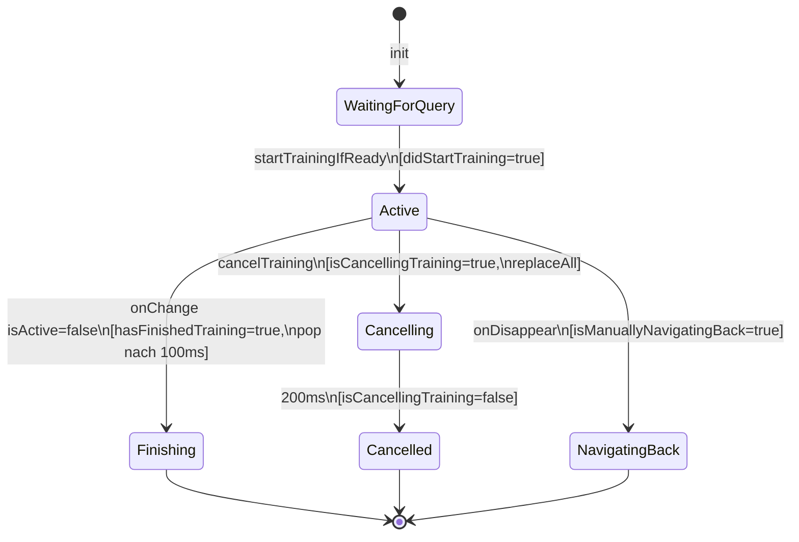

# TrainingView State-Machine Refactor (F2)

## Problem

[`TrainingView.swift:92-107`](FitnessApp/Features/Training/TrainingView.swift) hat einen 4-Flag-Negations-Guard:

```swift
if !isActive && didStartTraining && !hasFinishedTraining
   && !isManuallyNavigatingBack && !overlayState.isCancellingTraining { ... }
```

Vier lose `@State`-Booleans plus ein externer Flag bilden eine **implizite** State-Machine. Der `reviewing-code-changes`-Skill warnt: "if a fix requires observing more than 2 properties to detect a single logical event, it is likely a symptom fix" (§13g).

## Ziel

Die vier Flags durch `@State private var phase: Phase` ersetzen. Transitionen werden explizit, der Guard liest sich als `if phase == .active && !isActive`.

## Ist-Zustand — Flag-Transitionen



## Soll-Zustand — `enum Phase`

```swift
private enum Phase {
    case waitingForQuery
    case active
    case finishing
    case cancelling
    case navigatedBack
}

@State private var phase: Phase = .waitingForQuery
```

### Guard-Ersetzung

```swift
// ALT (4-Flag Negation)
if !isActive && didStartTraining && !hasFinishedTraining
   && !isManuallyNavigatingBack && !overlayState.isCancellingTraining {

// NEU (explizite Phase)
if !isActive && phase == .active {
```

### `overlayState.isCancellingTraining` — bleibt

`isCancellingTraining` lebt in `UIOverlayState` (shared). Wird von `FitnessAppApp.swift:129` gelesen um die BottomBar während Cancel auszublenden. Daher:

- `phase = .cancelling` ersetzt den lokalen Guard in `TrainingView`
- `overlayState.isCancellingTraining` bleibt für den Cross-View-Effekt (BottomBar)

## Änderungen

### Schritt 1 — `enum Phase` + `@State` einführen

- `enum Phase` als `private enum` in `TrainingView`
- `@State private var phase: Phase = .waitingForQuery`
- `hasFinishedTraining`, `isManuallyNavigatingBack`, `didStartTraining` **löschen**

### Schritt 2 — `startTrainingIfReady()` anpassen

```swift
private func startTrainingIfReady() {
    guard phase == .waitingForQuery, let model = models.first else { return }
    phase = .active
    trainingCoordinator.startTraining(for: model.toDomain())
}
```

### Schritt 3 — `onChange(of: isTrainingActive)` vereinfachen

```swift
.onChange(of: trainingCoordinator.isTrainingActive) { _, isActive in
    if !isActive && phase == .active {
        phase = .finishing
        overlayState.showTrainingMiniMenu = false
        Task { @MainActor in
            try? await Task.sleep(for: TimingConstants.popDelayAfterFinish)
            router.pop()
        }
    } else if !isActive && phase == .cancelling {
        overlayState.showTrainingMiniMenu = false
    }
}
```

### Schritt 4 — `cancelTraining()` anpassen

```swift
private func cancelTraining() {
    let targetCategory = trainingCoordinator.activeSetViewModel.originalCategory ?? category
    phase = .cancelling
    overlayState.isCancellingTraining = true
    overlayState.showTrainingMiniMenu = false
    trainingCoordinator.cancelTraining()
    router.replaceAll(with: [.home, .muscleCategory(targetCategory)])
    Task { @MainActor in
        try? await Task.sleep(for: TimingConstants.cancelOverlayHoldDuration)
        overlayState.isCancellingTraining = false
    }
}
```

### Schritt 5 — `onDisappear` anpassen

```swift
.onDisappear {
    phase = .navigatedBack
    overlayState.showTrainingMiniMenu = false
}
```

### Schritt 6 — FIXME-Comment löschen

Der FIXME(T8d-state-machine) wird durch die Phase-Enum obsolet.

## Validierung

- `grep -n "hasFinishedTraining\|isManuallyNavigatingBack\|didStartTraining" TrainingView.swift` → 0 Treffer
- `grep -n "FIXME(T8d-state-machine)" TrainingView.swift` → 0 Treffer
- `xcodebuild build -scheme FitnessApp` → grün
- `xcodebuild test -scheme "FitnessApp UITests"` → grün
- `reviewing-code-changes` Skill: §13g-Check → `phase == .active` statt 4-Flag-Negation

## Risiken

| Risiko | Mitigation |
|---|---|
| `onDisappear` feuert bevor `onChange(isActive)` | `.navigatedBack` blockiert pop, gleich wie heute `isManuallyNavigatingBack` |
| Cancel-Delay: `overlayState.isCancellingTraining` muss weiter gesetzt werden | Bleibt erhalten — nur lokaler Guard liest Phase |
| `startTrainingIfReady()` bei bereits aktiver Phase | Guard `phase == .waitingForQuery` verhindert Double-Start |

## Aufwand

~1.5h (Refactor + manueller Smoke-Test: Normal-Finish, Cancel, Back-Navigation)

## Was nicht passiert

- `overlayState.isCancellingTraining` in `UIOverlayState` bleibt (Cross-View)
- `TimingConstants` bleiben wie sie sind (F3-Cleanup korrekt)
- Kein Coordinator-Refactoring
