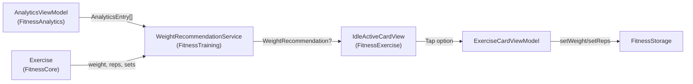

> Status: active | Created: 2026-04-24
> Companion: [RESEARCH.md](RESEARCH.md), [WIREFRAME.md](WIREFRAME.md)

## Kontext

Recherche-Bericht: [RESEARCH.md](RESEARCH.md). Wireframes: [WIREFRAME.md](WIREFRAME.md). Kurz: keine zweite Schaltfläche neben dem Play-Button (Material 3 anti-pattern, NN/g info-tip Blindness). Stattdessen **immer-sichtbare, dezente Suggestion-Zeile** unter `metricRow` mit Tap-zu-Vollflächen-Detail. Architektur: Senior-iOS-Stil — eigener Service im `FitnessTraining`-Package, regelbasierte Heuristik V1, deterministisch und testbar.

## Architektur



Der Service kennt nur Domain-Modelle, kein UI, kein SwiftData direkt. Das hält ihn rein testbar und konform zur **ui-state-sync**-Rule (kein Counter-Polling, keine Observation-Loops).

## Neue Files

- `Packages/FitnessTraining/Sources/FitnessTraining/WeightRecommendation/WeightRecommendation.swift`
  - `public struct WeightRecommendation: Equatable, Sendable` mit `options: [RecommendationOption]` (1-3) und `primaryReason: String`
  - `public struct RecommendationOption: Identifiable, Equatable, Sendable` mit `kind: OptionKind`, `weight: Double`, `reps: Int`, `reason: String`
  - `public enum OptionKind`: `.increaseWeight`, `.increaseReps`, `.maintain`, `.reduce`
- `Packages/FitnessTraining/Sources/FitnessTraining/WeightRecommendation/WeightRecommendationService.swift`
  - `public protocol WeightRecommendationProviding { func recommendation(for: Exercise, history: [AnalyticsEntry]) -> WeightRecommendation? }`
  - `public struct DefaultWeightRecommendationService: WeightRecommendationProviding`
  - Regeln (siehe Action Plan im Research-Bericht): 3 erfolgreiche Sessions → +Inkrement; Reps unter Soll → maintain; Reps deutlich über Soll (≥ +2) → kleinster Schritt + reduzierte Reps; weniger als 2 Sessions → `nil`
  - Inkrement-Berechnung: median der letzten Gewichts-Deltas pro Session, gerundet auf gültigen `WeightOptionsGenerator`-Schritt (0.5 kg)
- `Packages/FitnessTraining/Tests/FitnessTrainingTests/WeightRecommendationServiceTests.swift`
  - Eine Suite pro `OptionKind`-Pfad + Edge Cases (leere Historie, single Session, plötzlicher Drop, plateau über 5 Sessions)
  - Nutzt `AnalyticsEntry`-Fixtures aus `FitnessTestSupport`
- `Packages/FitnessExercise/Sources/FitnessExercise/IdleActiveCardView+Recommendation.swift`
  - Extension mit `recommendationRow` (Anchor-Delta-Zeile) und `recommendationDetailContent` (Vollflächen-Detail)
  - Lokaler `@State private var isShowingRecommendation = false`

## Änderungen an bestehenden Files

- [Packages/FitnessExercise/Sources/FitnessExercise/IdleActiveCardView.swift](Packages/FitnessExercise/Sources/FitnessExercise/IdleActiveCardView.swift)
  - Neuer State: `@State private var recommendation: WeightRecommendation?` und `@State private var isShowingRecommendation = false`
  - Neuer Init-Parameter: `recommendationService: WeightRecommendationProviding` (Default: `DefaultWeightRecommendationService()`)
  - In `refreshPhaseData()` zusätzlich: `recommendation = recommendationService.recommendation(for: viewModel.exercise, history: analyticsViewModel.entries(for: viewModel.exercise.id))`
  - In `body` neue Bedingung:

```swift
if isShowingRecommendation {
    recommendationDetailContent
} else {
    headerRow
    if let recommendation { recommendationRow(recommendation) }
    if isExpanded, !weightPhases.isEmpty { expandedContent }
}
```

  - `recommendationRow`: HStack mit `Image(systemName: "lightbulb.fill")` (GreenGlow), kompakter Text "+5 kg · 8 reps", chevron rechts. Tap → `isShowingRecommendation = true`. Style: glass background niedrige Opazität.
  - `recommendationDetailContent`: VStack mit Title "Vorschlag", `primaryReason`-Subtext, ForEach über `recommendation.options` als `RecommendationOptionTile` (3 nebeneinander wie `phaseTilesRow`), Close-Button oben rechts. Tap auf Tile → `viewModel.exercise.weight = option.weight; viewModel.exercise.reps = option.reps` über existierenden Storage-Pfad in `ExerciseCardViewModel`, dann `isShowingRecommendation = false`.
- [Packages/FitnessExercise/Sources/FitnessExercise/ExerciseCardContainerView.swift](Packages/FitnessExercise/Sources/FitnessExercise/ExerciseCardContainerView.swift)
  - Reicht `recommendationService` durch (oder nutzt Default)
- [Packages/FitnessTraining/Package.swift](Packages/FitnessTraining/Package.swift) — bereits Dependency auf FitnessAnalytics? Falls nicht: hinzufügen
- [.cursor/references/architecture-documentation.md](.cursor/references/architecture-documentation.md) — neue Sektion "Weight Recommendation" unter Services + Erwähnung in Trainingskachel-Block

## UX-Verhalten

1. **Idle ohne Recommendation** (z. B. neue Übung, < 2 Sessions): aktuelle Card unverändert.
2. **Idle mit Recommendation**: Card zeigt zusätzliche Zeile zwischen `metricRow` und (optional ausgeklapptem) `expandedContent`. Beispiel: `💡 +5 kg · 8 reps   ›`
3. **Tap auf Recommendation-Zeile**: alles in der Card außer dem statischen Header verschwindet, Vollflächen-Detail erscheint im selben Container. 3 Tiles untereinander oder nebeneinander, jede mit eigenen Werten + 1-Zeilen Reason.
4. **Tap auf Tile**: `Exercise` wird aktualisiert, Detail kollabiert, Card zeigt neue Werte in `metricRow`.
5. **Tap auf Close oder außerhalb**: Detail kollabiert ohne Änderung.

## V1 Heuristik-Pseudocode

```
last3 = history.sorted(by: date).suffix(3)
if history.count < 2: return nil

avgRepsLastSession = mean(last1.setProgress.currentReps)
soll = exercise.reps

case A — alle last3 erfolgreich (avgReps >= soll):
    inc = median(weightDeltas across last3) ?? defaultIncrement(for: exercise)
    options = [.increaseWeight(weight: current+inc, reps: soll, reason: "Du erhöhst meist um \(inc) kg"),
               .increaseReps(weight: current, reps: soll+2, reason: "Oder versuche \(soll+2) Wiederholungen")]

case B — last1 deutlich über soll (avgReps >= soll+2):
    options = [.increaseWeight(weight: current+0.5, reps: max(soll-2, soll), reason: "Letztes Mal \(avgReps) Reps geschafft"),
               .increaseReps(weight: current, reps: soll+2, reason: "Oder häng noch 2 Reps dran")]

case C — last1 unter soll (avgReps < soll):
    options = [.maintain(weight: current, reps: soll, reason: "Letztes Mal nur \(avgReps) — versuche \(soll) zu halten")]

case D — last1 deutlich unter soll (avgReps <= soll * 0.6):
    options = [.reduce(weight: current-defaultIncrement, reps: soll, reason: "Reduziere kurz, sonst Plateau")]

return WeightRecommendation(options: options, primaryReason: humanizedFromHistory)
```

## Tests

- Unit Tests für Service: 8-10 Tests, alle Pfade + Edge Cases (`Packages/FitnessTraining/Tests/...`)
- UI-Tests: nicht in V1 nötig — Recommendation-Zeile rendert nur bei vorhandener Historie, Bestehende UI-Tests bleiben grün
- Manual Validation per `reviewing-code-changes` Skill nach Implementierung (laut `code-changes-enforcement` Rule pflicht)

## Out of Scope (V2)

- TipKit Onboarding für Erstnutzer der Funktion
- "Recommendation X Sessions ignoriert → suppress" Logik
- ML-basierte Empfehlung (Hook über Protocol bereits vorbereitet)
- A/B Test Telemetrie