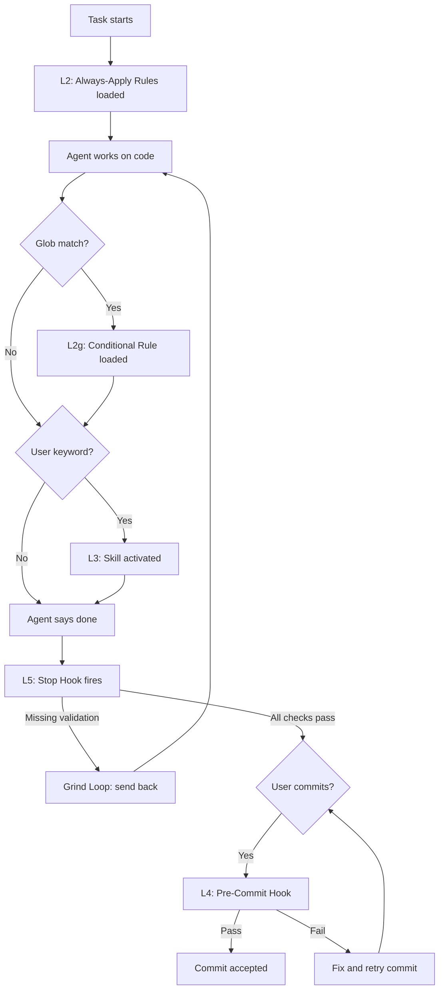

# Agent System Overview

Central map of all enforcement mechanisms grouped by reliability level.

## Layer Overview

| Level | Type | Reliability | Trigger |
|---|---|---|---|
| L1 | Conversation | ~50% | User mentions it in chat |
| L2 | Always-Apply Rules | ~80% | Loaded into every chat automatically |
| L2g | Glob-Triggered Rules | ~80% | Loaded when matching files are edited |
| L3 | Skills | ~85-90% | Keyword match from user prompt |
| L3 | Commands | ~95% | Explicit user-triggered `/command` |
| L4 | Pre-Commit Hook | 100% | Deterministic, blocks bad commits |
| L5 | Stop Hook / Grind Loop | 100% | Deterministic, fires when agent says "done" |

## Execution Order

When the agent works on a task, enforcement fires in this order:

## L2 — Always-Apply Rules

| File | What it does | Triggers/References |
|---|---|---|
| `code-changes-enforcement.mdc` | Enforces post-change validation for 1+ Swift files. Three layers: advisory rule, stop hook, pre-commit. | `post-task-check.sh`, `code-changes.stamp.md`, `reviewing-code-changes/SKILL.md` |
| `build-and-test.mdc` | All xcodebuild commands (build, unit/UI/package tests). DEVELOPER_DIR setup. Forbids swift test/swift build. | Referenced by hook, command, 2 skills |
| `architecture-documentation-sync.mdc` | Enforces architecture-documentation.md sync when structural Swift changes occur. Stop hook Check 2 verifies at task end. | `architecture-documentation.md`, `reviewing-code-changes/SKILL.md` |

## L2g — Glob-Triggered Rules

| File | Glob Pattern | What it does |
|---|---|---|
| `agent-infrastructure-enforcement.mdc` | `.cursor/**/*.md`, `.cursor/**/*.mdc`, `.cursor/**/*.sh` | Enforces agent-infrastructure validation when .cursor/ files change. Two layers: this rule (advisory) + stop hook Check 6. |

## L3 — Skills

| File | What it does | Triggers/References |
|---|---|---|
| `create-feature/SKILL.md` | Scaffold new SwiftUI features with MVVM, AppStyle, navigation, tests. | `architecture-documentation.md`, `ui-test-conventions.md` |
| `reviewing-code-changes/SKILL.md` | Code review + post-change validation. Dead code, reuse, AppStyle, layout, MVVM, navigation, architecture principles, anti-patterns, referential integrity, architecture sync. | `architecture-documentation.md`, `code-changes.stamp.md` |
| `reviewing-test-quality/SKILL.md` | Unit/integration test quality review. | `architecture-documentation.md`, `test-execution.stamp.md` |
| `reviewing-agent-effectiveness/SKILL.md` | Diagnose which enforcement mechanisms fired (FIRED/NOT FIRED/N/A report). Hands off gaps to `reviewing-agent-infrastructure` skill. | All rules, skills, hooks |
| `writing-ui-tests/SKILL.md` | Create new XCUITests. | `ui-test-conventions.md` |
| `updating-ui-tests/SKILL.md` | Fix/modernize existing XCUITests. | `ui-test-conventions.md` |
| `reviewing-agent-infrastructure/SKILL.md` | Validate and fix agent infrastructure after .cursor/ changes. Reference integrity, agent-system-overview sync, learning persistence. | `reviewing-agent-effectiveness/SKILL.md`, `reviewing-code-changes/SKILL.md` |
| `deep-research/SKILL.md` | Citation-backed deep research workflow. | None |

## L3 — Commands

| File | What it does |
|---|---|
| `validate.md` | `/validate` — run post-change validation, tests, write stamps. |

## L4 — Pre-Commit Hook

| File | What it checks |
|---|---|
| `.git/hooks/pre-commit` | 1+ staged Swift files without fresh `code-changes.stamp.md`. Blocks commit with RULE/VIOLATION/FIX message. |

## L5 — Stop Hook

Two enforcement patterns: **Grind Loop** (agent is sent back up to 3 times) and **Hint** (one-time suggestion).

| File | Pattern | What it checks |
|---|---|---|
| `post-task-check.sh` | Orchestrator | Runs all 6 checks below, collects followup messages. |
| `hooks.json` | — | Registers `post-task-check.sh` as stop hook with `loop_limit: 3`. |
| `checks/code-validation.sh` | Grind Loop | Swift files changed — validation stamp fresh? |
| `checks/architecture-sync.sh` | Stateless | Structural changes — architecture-documentation.md updated? |
| `checks/test-execution.sh` | Grind Loop | Test files changed — tests actually run? |
| `checks/test-coverage.sh` | Hint | New ViewModel/Service — corresponding test file exists? |
| `checks/enforcement-audit.sh` | Hint | 5+ Swift files — suggest enforcement audit? |
| `checks/agent-infrastructure.sh` | Grind Loop | .cursor/ files changed — infra stamp fresh? |
| `lib/grind-loop.sh` | Library | Shared grind-loop logic (stamp check, scratchpad, iteration). |

## References (no enforcement level)

| File | What it contains |
|---|---|
| `architecture-documentation.md` | Feature Map, packages, navigation, services, domain models, AppStyle tokens. |
| `ui-test-conventions.md` | DSL functions, selector patterns, timeout defaults, test templates. |
| `agent-system-overview.md` | This file — layer map and trigger chains. |

## State Files

| File | Written by (Skill) | Read by (Hook) | What it contains |
|---|---|---|---|
| `code-changes.stamp.md` | `reviewing-code-changes` | `code-validation.sh` | Proof that code validation ran |
| `code-changes.scratchpad.json` | `code-validation.sh` | `code-validation.sh` | Grind loop state (iteration, diff hash) |
| `test-execution.stamp.md` | `reviewing-test-quality`, `build-and-test` | `test-execution.sh` | Proof that tests ran |
| `test-execution.scratchpad.json` | `test-execution.sh` | `test-execution.sh` | Grind loop state (iteration, diff hash) |
| `agent-infrastructure.stamp.md` | `reviewing-agent-infrastructure` | `agent-infrastructure.sh` | Proof that infra validation ran |
| `agent-infrastructure.scratchpad.json` | `agent-infrastructure.sh` | `agent-infrastructure.sh` | Grind loop state (iteration, diff hash) |
| `agent-infrastructure.log.md` | `reviewing-agent-infrastructure` | — | Cumulative log of agent learnings |
| `enforcement-audit.hint-hash.txt` | `enforcement-audit.sh` | `enforcement-audit.sh` | Dedup hint for enforcement audit |
| `test-coverage.hint-hash.txt` | `test-coverage.sh` | `test-coverage.sh` | Dedup hint for test coverage |
