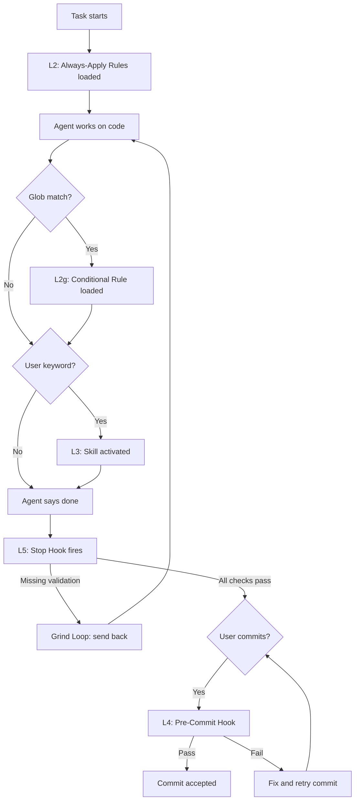

# Enforcement Layers

Central map of all enforcement mechanisms grouped by reliability level.

## Layer Overview

| Level | Type | Reliability | Trigger |
|---|---|---|---|
| L1 | Conversation | ~50% | User mentions it in chat |
| L2 | Always-Apply Rules | ~80% | Loaded into every chat automatically |
| L2g | Glob-Triggered Rules | ~80% | Loaded when matching files are edited |
| L3 | Skills | ~85-90% | Keyword match from user prompt |
| L3 | Commands | ~95% | Explicit user-triggered `/command` |
| L3 | Agents | ~85-90% | Called by skills or rules |
| L4 | Pre-Commit Hook | 100% | Deterministic, blocks bad commits |
| L5 | Stop Hook / Grind Loop | 100% | Deterministic, fires when agent says "done" |

## Execution Order

When the agent works on a task, enforcement fires in this order:

## L2 — Always-Apply Rules

| File | What it does | Triggers/References |
|---|---|---|
| `validation-enforcement.mdc` | Enforces post-change validation for 1+ Swift files. Three layers: advisory rule, stop hook, pre-commit. | `post-task-check.sh`, `validation-stamp.md`, `reviewing-code-changes/SKILL.md`, `post-change-validator.md` |
| `build-and-test.mdc` | All xcodebuild commands (build, unit/UI/package tests). DEVELOPER_DIR setup. Forbids swift test/swift build. | Referenced by hook, command, 2 skills |
| `agent-learning.mdc` | Active Rules Acknowledgment, Self-Improvement Protocol, Repetition Detection, Self-Review Rule. | `reviewing-agent-infrastructure/SKILL.md`, `learning-log.md` |
| `swiftui-quality-check.mdc` | Silent layout checklist after every SwiftUI View change (magic numbers, fixedSize, tap targets). | None (local check) |
| `swift-architecture.mdc` | AppStyle tokens, shared components, MVVM, navigation, Protocol+DI for services, bug fix layering. | `architecture.md` |
| `docs-sync.mdc` | Keep architecture.md in sync with code changes. Trigger map for structural changes. | `architecture.md`, `ui-test-conventions.md`, `enforcement-layers.md` |

## L2g — Glob-Triggered Rules

| File | Glob Pattern | What it does |
|---|---|---|
| `post-refactoring-checklist.mdc` | `*ViewModel*.swift`, `*Coordinator*.swift` | Checks @Published propagation, cached VMs, conditional views after refactoring. |

## L3 — Skills

| File | What it does | Triggers/References |
|---|---|---|
| `create-feature/SKILL.md` | Scaffold new SwiftUI features with MVVM, AppStyle, navigation, tests. | `architecture.md`, `ui-test-conventions.md` |
| `reviewing-code-changes/SKILL.md` | Dead code, reuse, consistency checks after changes. | `architecture.md`, `validation-stamp.md` |
| `reviewing-swift-code/SKILL.md` | Architecture/style review for Swift/SwiftUI. | `architecture.md` |
| `reviewing-test-quality/SKILL.md` | Unit/integration test quality review. | `architecture.md`, `test-stamp.md` |
| `reviewing-agent-effectiveness/SKILL.md` | Diagnose which enforcement mechanisms fired (FIRED/NOT FIRED/N/A report). Hands off gaps to `reviewing-agent-infrastructure` skill. | All rules, skills, hooks, agents |
| `writing-ui-tests/SKILL.md` | Create new XCUITests. | `ui-test-conventions.md`, `ui-test-selector-creator.md`, `ui-test-reviewer.md` |
| `updating-ui-tests/SKILL.md` | Fix/modernize existing XCUITests. | `ui-test-conventions.md`, `ui-test-selector-creator.md`, `ui-test-reviewer.md` |
| `reviewing-agent-infrastructure/SKILL.md` | Validate and fix agent infrastructure after .cursor/ changes. Reference integrity, enforcement-layers sync, learning persistence. | `reviewing-agent-effectiveness/SKILL.md`, `swift-architecture.mdc`, `reviewing-swift-code/SKILL.md` |
| `deep-research/SKILL.md` | Citation-backed deep research workflow. | None |

## L3 — Commands

| File | What it does |
|---|---|
| `validate.md` | `/validate` — run post-change validation, tests, write stamps. |

## L3 — Agents (Subagents)

| File | What it does | Triggers/References |
|---|---|---|
| `update-architecture-context.md` | Keep architecture.md in sync with structural code changes. | `architecture.md`, `ui-test-conventions.md`, `ui-test-reviewer.md`, `ui-test-selector-creator.md` |
| `ui-test-selector-creator.md` | Prepare production code for UI testing (accessibility IDs, selectors). | `ui-test-conventions.md`, `architecture.md` |
| `ui-test-reviewer.md` | Review UI tests against conventions. | `ui-test-conventions.md` |
| `post-change-validator.md` | Run post-change validation checklist. | `reviewing-code-changes/SKILL.md` |
| `style-auditor.md` | Flag hardcoded styling vs AppStyle. | None |

## L4 — Pre-Commit Hook

| File | What it checks |
|---|---|
| `.git/hooks/pre-commit` | 1+ staged Swift files without fresh validation-stamp.md. Blocks commit with RULE/VIOLATION/FIX message. |

## L5 — Stop Hook (Grind Loop)

| File | What it checks |
|---|---|
| `post-task-check.sh` | Check 1: Validation stamp fresh? Check 2: architecture.md updated? Check 3: Tests run if test files changed? Check 4: Tests exist for new ViewModels/Services? Check 5: Enforcement-Audit hint for 5+ files. |
| `hooks.json` | Registers `post-task-check.sh` as stop hook with loop_limit 4. |

## References (no enforcement level)

| File | What it contains |
|---|---|
| `architecture.md` | Feature Map, packages, navigation, services, domain models, AppStyle tokens. |
| `ui-test-conventions.md` | DSL functions, selector patterns, timeout defaults, test templates. |
| `enforcement-layers.md` | This file — layer map and trigger chains. |
| `agent-workflow-enforcement.md` | Deep research on enforcing agent workflows (historical). |
| `architecture-evaluation.md` | Playbook for architecture evaluation (seldom used). |
| `code-evaluation-system.md` | Codebase analysis workflow (seldom used). |

## State Files

| File | What it contains |
|---|---|
| `hooks/state/validation-stamp.md` | Proof that validation ran (date, PASS/FAIL, files, findings). |
| `hooks/state/test-stamp.md` | Proof that tests ran (date, PASS/FAIL, target, counts). |
| `hooks/state/learning-log.md` | Log of agent learnings (date, what was learned, which file updated). |
| `hooks/state/scratchpad.json` | Grind loop state (iteration count, diff hash). |
